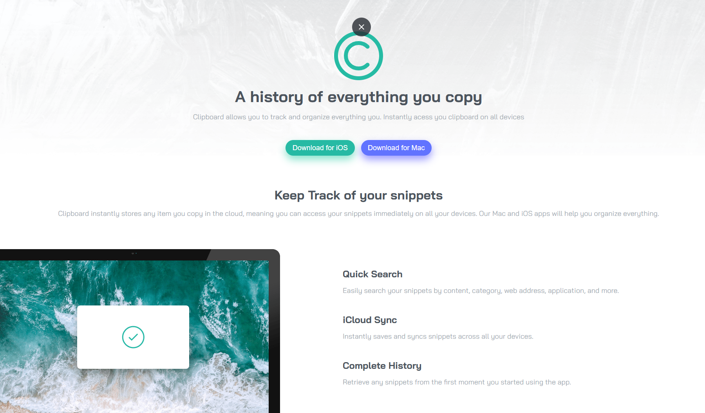
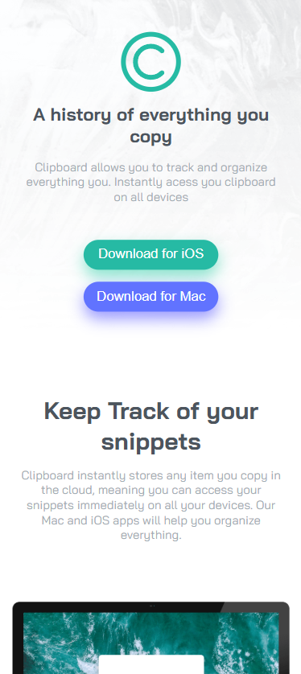

<h1 align="center"> Frontend Mentor - Clipboard Landing Page</h1>

Essa é uma solução para o [Desafio Clipboard Landing Page](https://www.frontendmentor.io/challenges/clipboard-landing-page-5cc9bccd6c4c91111378ecb9). Os desafios do Frontend Mentor ajudam você a aprimorar suas habilidades de programação por meio da criação de projetos realistas.

    

## 💻 Projeto

Este projeto é uma landing page da Clipboard, feita com React para aprender sobre componentização

## Acesse o Clipboard Landing Page [clicando aqui](https://antoniorafaeldev.github.io/clipboard-landing-page-react/)

## 🚀 Tecnologias

Esse projeto foi desenvolvido com as seguintes tecnologias:

- JavaScript
- CSS
- React
- Git e GitHUb

### O Que Aprendi

- Aprendi sobre como iniciar projetos em React
- Aprendi sobre componentização de elementos em React

## Screenshot do resultado

### Versão Desktop

 
    

### Versão Mobile

 
    

## Autor 

- Website - [Antônio Rafael](https://github.com/antoniorafaeldev)
- Frontend Mentor - [@Antonio-Rafael-Silva](https://www.frontendmentor.io/profile/antoniorafaeldev)
- Linkedin - [Antônio Rafael](https://www.linkedin.com/in/ant%C3%B4nio-rafael-01131b372/)

